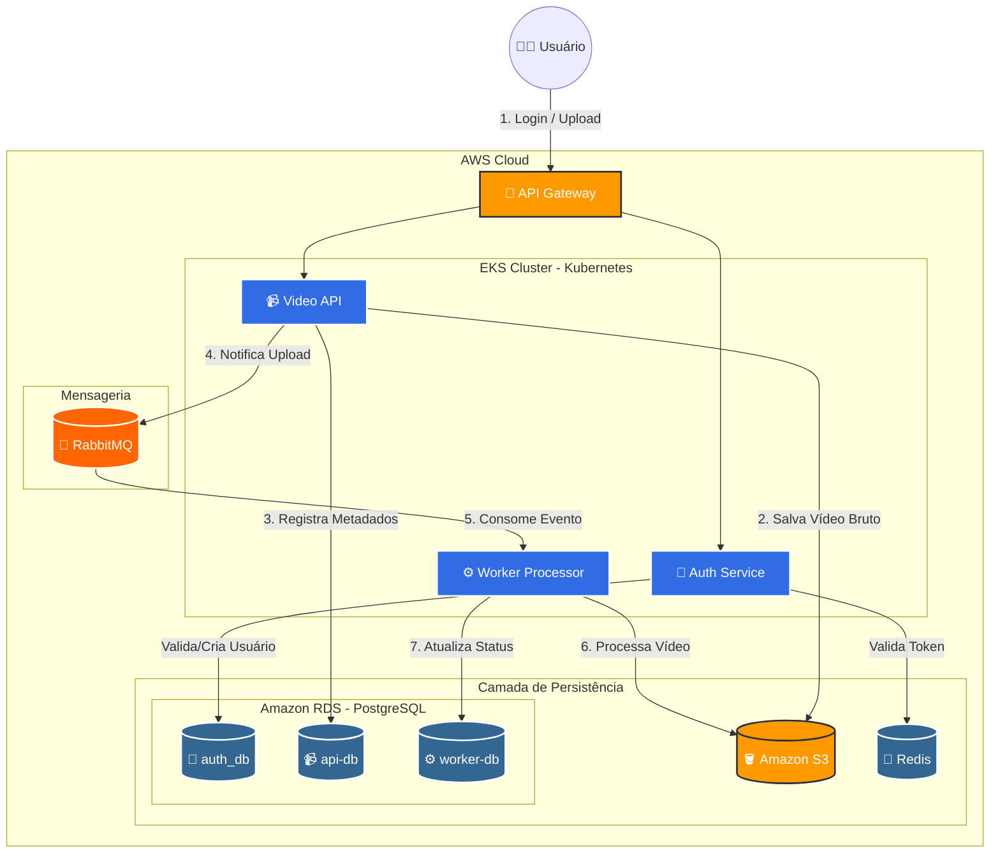

# 🏗️ Solução FIAP X - Infraestrutura EKS e Arquitetura do Sistema

## Integrantes - Grupo 250 do Hackathon FIAP
*   Thiago Frozzi Ramos - RM363916
*   Denise da Silva Ferreira - RM360753
*   Humberto Moura Feitoza - RM360753

---

## 🏛️ Arquitetura do Sistema

O sistema foi concebido como uma plataforma de **Processamento Distribuído de Vídeos**, utilizando uma arquitetura orientada a eventos (Event-Driven) para garantir escalabilidade e resiliência. A solução roda em um cluster **Amazon EKS (Kubernetes)** e utiliza serviços gerenciados da AWS para persistência e mensageria.

### 🧩 Componentes Principais

#### 1. Entrada e Segurança (Edge & Auth)
*   **API Gateway:** Ponto único de entrada para todas as requisições externas.
*   **Auth Service (`fiapx-app-auth`):** Microsserviço dedicado à autenticação e autorização. Utiliza **JWT** para tráfego seguro e **Redis** para gestão de sessões e performance.

#### 2. Orquestração e Upload (Core)
*   **Video API (`fiapx-app-api`):** Gerencia o ciclo de vida inicial do vídeo. Recebe o upload, armazena o binário bruto no **Amazon S3**, registra metadados no **PostgreSQL** e dispara eventos de processamento.

#### 3. Processamento Assíncrono (Worker)
*   **Worker Processor (`fiapx-app-worker`):** O componente de "heavy lifting". Consome mensagens do **RabbitMQ**, baixa o vídeo do S3, realiza o processamento (extração de imagens/frames) e gera um arquivo compactado (ZIP) de retorno.

#### 4. Camada de Dados e Mensageria
*   **Amazon RDS (PostgreSQL):** Banco de dados relacional para metadados de vídeos e usuários.
*   **Amazon MQ (RabbitMQ):** Broker de mensagens para desacoplamento entre a API e o Worker.
*   **Amazon S3:** Storage de objetos para vídeos originais e arquivos processados.
*   **ElastiCache (Redis):** Cache de alta performance para o serviço de autenticação.

---

### 📌 Principais Endpoints da API

| Microsserviço | Método | Rota | Descrição |
| :--- | :--- | :--- | :--- |
| **Auth** | `POST` | `/auth/login` | Autentica o usuário e retorna o token JWT. |
| **Video API** | `POST` | `/api/videos/upload` | Recebe um ou mais vídeos para processamento. |
| **Video API** | `GET` | `/api/videos/status` | Lista o status de todos os vídeos do usuário logado. |
| **Video API** | `POST` | `/api/videos/{id}/status` | Endpoint interno para atualização de status (usado pelo Worker). |

---

### 📐 Diagrama de Arquitetura

---

## 🛠️ Stack Tecnológica

*   **Linguagem:** Java 17
*   **Framework:** Spring Boot 3.2.2
*   **Segurança:** Spring Security + JWT
*   **Infraestrutura:** Terraform (IaC), AWS EKS, Docker
*   **Mensageria:** RabbitMQ (Protocolo AMQP)
*   **Qualidade:** JaCoCo e SonarCloud

---

## 📊 Diferenciais da Solução (Hackathon)

1.  **Escalabilidade Horizontal:** O Worker Processor pode ser escalado independentemente da API (usando K8s HPA) conforme a fila do RabbitMQ cresce.
2.  **Arquitetura Hexagonal:** O uso de *Ports and Adapters* na Video API permite trocar o banco de dados ou o provider de nuvem com mínimo impacto.
3.  **Segurança Stateless:** Toda a comunicação é protegida por JWT, eliminando a necessidade de manter estado de sessão no servidor da API.
4.  **Resiliência:** Se o Worker falhar, a mensagem volta para a fila, garantindo que nenhum vídeo deixe de ser processado.
